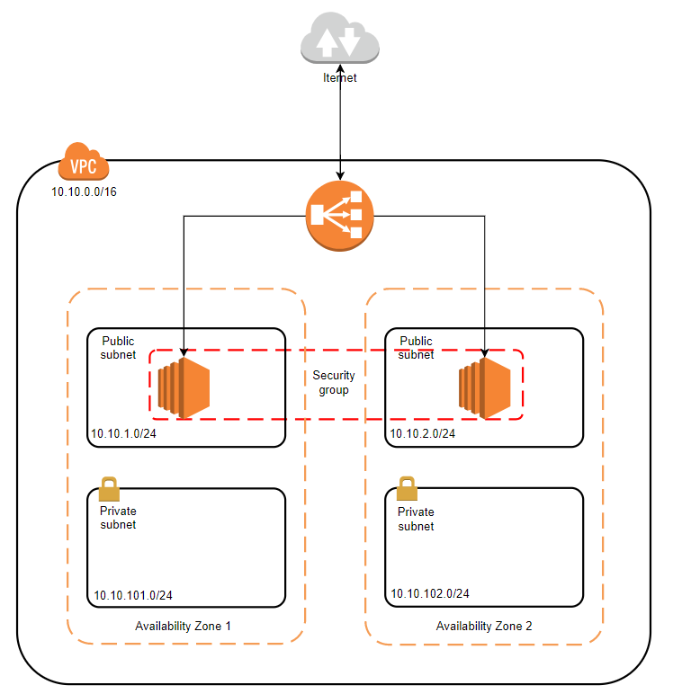

# CloudFormation Templates for Getting Started Tutorial with AWS Elastic Load Balacing
- ### Classic load balancer: 
[](https://console.aws.amazon.com/cloudformation/home?#/stacks/new?stackName=clb-getting-started&templateURL=https://s3-ap-southeast-1.amazonaws.com/nthienan-public/cloudformation/aws-elb/classic-elb.yaml)
  
  - Architecture
  
  

  - **Create stack**:
    ```bash
    aws cloudformation create-stack --stack-name clb-getting-started --template-body file://classic-elb.yaml --parameters ParameterKey=KeyName,ParameterValue=<existing-ec2-key-pair-name>
    ```

  - **Update stack**:
    ```bash
    aws cloudformation update-stack --stack-name clb-getting-started --template-body file://classic-elb.yaml --parameters ParameterKey=KeyName,ParameterValue=<existing-ec2-key-pair-name>
    ```

  - **Delete stack**:
    ```bash
    aws cloudformation delete-stack --stack-name clb-getting-started
    ```

  - **Describe stack**:
    ```bash
    aws cloudformation describe-stacks --stack-name --stack-name clb-getting-started
    ```